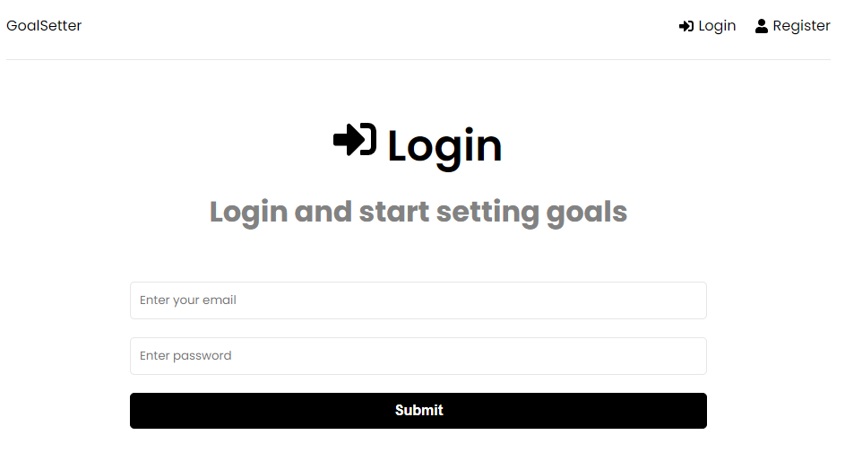

<p align="center">

  

  

  

</p>
<h1 align="center">
    
</h1>

<h4 align="center">
	Goal Setter 🚀
</h4>

<p align="center">
 <a href="#-about">About</a> •
 <a href="#-features">Features</a> •
 <a href="#-setup">Setup</a> •
 <a href="#-technologies">Technologies</a> •
 <a href="#-license">License</a>
</p>


## 💻 About

Login in the platform and set your future goals!

Fullstack project developed with the MERN Stack.

Registered Users can create Goals persisting the data on the project with JWT Authentication, Node.js + Express + MongoDB on the backend, and Redux + React on the Frontend.

---

## 🌐 Live Example

[You can access a Live Example clicking Here](https://mern-goals-rafaelnps.herokuapp.com/login)

## ⚙️ Features

- [X] Dashboard
  - [x] Create new Goals
  - [x] Delete Goals
- [x] Authentication
  - [x] Register User
  - [x] Login User
  - [x] Logout


## Examples

<p align="center" style="display: flex; align-items: flex-start; justify-content: center;">
  

  
</p>

---

## 🚀 Setup

### Prerequisites

node >= v12

#### 🎲 Running the project

```bash
# Clone this repository
$ git clone https://github.com/rafanp/goals-setter.git

# Install the dependencies
$ npm install

# Install frontend dependencies
$ cd frontend && npm install

# Copy the .env.example file and create a new .env
# Insert your own MONGO_URI and JWT_SECRET 

# Run server and client
$ npm run dev
```
---

## 🛠 Technologies

The following technologies are used during this project development:

#### **Web Frontend**
-   **[React](https://reactjs.org/)**
-   **[React Router Dom](https://github.com/ReactTraining/react-router/tree/master/packages/react-router-dom)**
-   **[React Icons](https://react-icons.github.io/react-icons/)**
-   **[Axios](https://github.com/axios/axios)**
-   **[Redux](https://redux.js.org/)**
-   **[Redux Toolkit](https://redux-toolkit.js.org/)**
-   **[Redux Toastify](https://www.npmjs.com/package/react-toastify)**


#### **Backend**
-   **[Node.js](https://nodejs.org)**
-   **[Express](https://expressjs.com/)**
-   **[Mongoose](https://mongoosejs.com/)**
-   **[JWT Authentication](https://www.npmjs.com/package/jsonwebtoken)**


#### **Deploy**
- Project deployed on Heroku


---

## 📝 License

Developed by Rafael Neves, based on the [Traversy Media](https://www.youtube.com/c/TraversyMedia) channel.

[Send me a message!](https://www.linkedin.com/in/rafaelnps/)

---